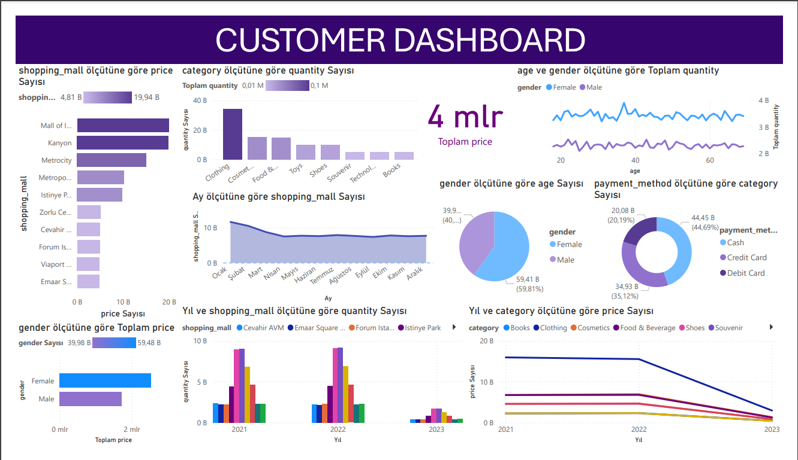

Bu proje,müşterilerin alışveriş verilerini analiz etmek ve görselleştirir ve
analiz eder
# Bağımlılıklar
Projeyi çalıştırmak için gerekli kütüphaneler:
numpy 
pandas
matplotlib.pyplot 
seaborn 

# çalışması için gereken kurulumlar

```python
    python -m venv venv
    source venv\Scripts\activate
    pip install -r requirements.txt
    jupyter notebook
```

